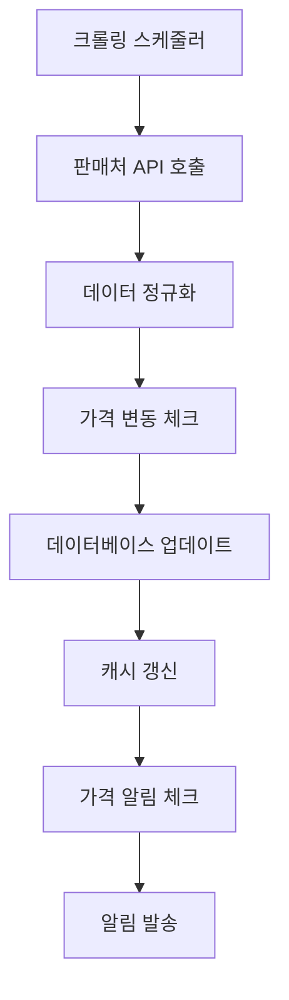
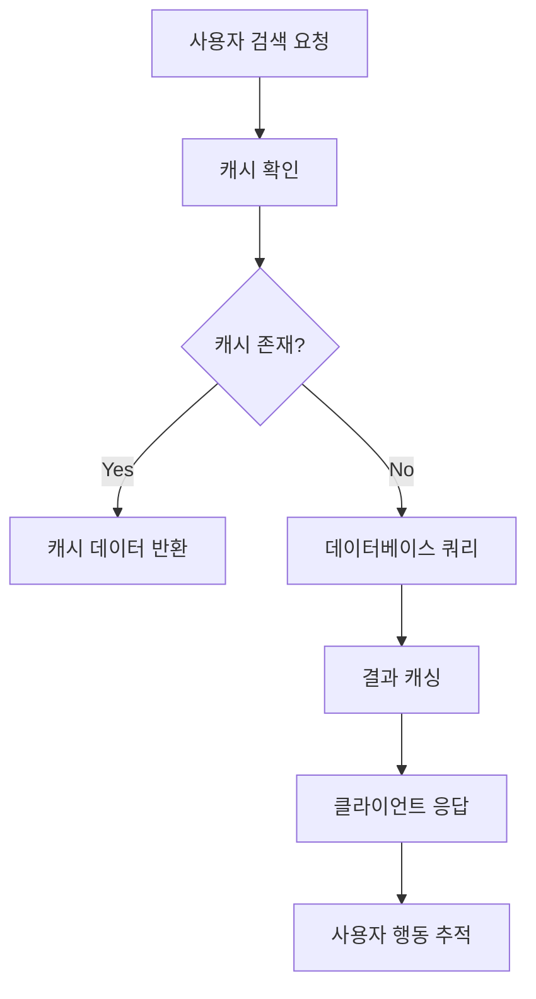

# 휴대폰 가격 비교 웹앱 개발 문서
## 대한민국 20-30대 타겟 모바일 우선 웹 애플리케이션

---

## 📋 프로젝트 개요

### 프로젝트명
**우지(UZI)** - 스마트한 휴대폰 구매를 위한 가격 비교 플랫폼

### 목적
대한민국 20-30대 사용자를 위한 직관적이고 투명한 휴대폰 가격 비교 서비스 제공

### 핵심 가치 제안
- **정보 투명성**: 숨겨진 비용 없는 정확한 가격 정보
- **맞춤형 경험**: 사용자 선호도 기반 추천 시스템
- **편의성**: 복잡한 구매 과정을 단순화

---

## 🎯 타겟 사용자

### Primary Persona
- **연령**: 20-30대
- **직업**: 직장인, 대학생, 프리랜서
- **특성**: 
  - 디지털 네이티브 세대
  - 온라인 정보 검색에 익숙
  - 가성비를 중시하며 합리적 소비 추구
  - 모바일 우선 사용 패턴

### 사용자 니즈
1. **정보 비대칭 해결**: 복잡한 요금제와 할인 구조 이해
2. **시간 절약**: 여러 쇼핑몰과 대리점 비교 시간 단축
3. **투명성**: 실제 총 비용 파악
4. **편의성**: 언제 어디서나 접근 가능한 모바일 경험

---

## 🔄 핵심 사용자 시나리오

### 시나리오 1: 갤럭시 선택 후 가격 비교
```
사용자: 김민수 (28세, 직장인)
상황: 새로운 스마트폰 구매를 위해 갤럭시 모델을 고려 중

1. 메인 페이지 진입
   - "갤럭시" 또는 "아이폰" 선택 버튼 확인
   - "갤럭시" 선택

2. 갤럭시 모델 선택
   - 최신 모델부터 구형 모델까지 리스트 표시
   - 주요 스펙과 출고가 함께 표시
   - "갤럭시 S25" 선택

3. 필터 적용
   - 저장용량: 256GB 선택
   - 구매 방식: "모든 방식" 선택
   - 지역: "서울 강남구" 입력 (위치 기반 추천)

4. 결과 확인
   - 가격순 정렬로 결과 표시
   - 온라인 대리점, 오프라인 매장, 공식몰 가격 비교
   - 총 비용 (단말기 + 2년 통신비) 계산 표시

5. 상세 정보 확인
   - 각 판매처별 조건 및 혜택 상세 보기
   - 사용자 리뷰 및 평점 확인
   - 가격 알림 설정

6. 구매 연결
   - 원하는 판매처 선택
   - 외부 사이트로 연결 또는 상담 예약
```

### 시나리오 2: 아이폰 선택 후 도보권 매장 찾기
```
사용자: 이지영 (25세, 대학생)
상황: 아이폰으로 기종 변경 예정, 직접 매장 방문 선호

1. 메인 페이지에서 "아이폰" 선택

2. 아이폰 모델 선택
   - "아이폰 15" 선택
   - 색상 및 저장용량 옵션: "128GB, 블루" 선택

3. 위치 기반 검색
   - 현재 위치 허용 또는 주소 입력
   - "도보 15분 거리내" 필터 적용

4. 근처 매장 결과
   - 지도 뷰와 리스트 뷰 전환 가능
   - 각 매장별 가격, 거리, 평점 표시
   - 재고 여부 실시간 확인

5. 매장 상세 정보
   - 영업시간, 연락처, 상세 위치
   - 해당 매장 특별 혜택
   - 방문 예약 기능

6. 경로 안내
   - 지도 앱 연동하여 길찾기
   - 매장 연락처로 직접 통화 가능
```

---

## 🏗️ 시스템 아키텍처

### 기술 스택

#### Frontend
- **Framework**: React 18+
- **Styling**: Tailwind CSS + Headless UI
- **HTTP Client**: Axios
- **Maps**: Kakao Map API

#### Backend
- **Runtime**: Node.js 18+
- **Framework**: Express.js
- **Database**: PostgreSQL + Redis (캐싱)
- **Authentication**: NextAuth.js
- **File Storage**: AWS S3

## 🎨 UI/UX 디자인 시스템

### 컬러 팔레트
- **Primary**: #3B82F6 (Blue-500) - 주요 CTA 버튼, 로고
- **Secondary**: #1E40AF (Blue-700) - 호버 상태, 활성 상태
- **Accent**: #F59E0B (Amber-500) - 가격 강조, 할인 표시
- **Success**: #10B981 (Emerald-500) - 구매 완료, 성공 메시지
- **Warning**: #F59E0B (Amber-500) - 주의사항, 재고 부족
- **Error**: #EF4444 (Red-500) - 오류 메시지
- **Text**: #1E293B (Slate-800) - 본문 텍스트
- **Background**: #F8FAFC (Slate-50) - 메인 배경

### 타이포그래피
- **Primary Font**: Pretendard (제목, 버튼, 중요 텍스트)
- **Secondary Font**: Noto Sans KR (본문, 설명글)
- **Display Font**: Pretendard ExtraBold (히어로 섹션)
- **Mono Font**: IBM Plex Mono (가격 표시)

### 반응형 브레이크포인트
```css
/* Mobile First Approach */
mobile: '320px',
sm: '640px',
md: '768px',
lg: '1024px',
xl: '1280px',
'2xl': '1536px'
```

---

## 🔧 주요 기능 명세

### 1. 홈페이지 (/)
#### 기능 개요
사용자가 갤럭시 또는 아이폰을 선택하여 가격 비교를 시작하는 메인 페이지

#### 주요 구성 요소
1. **브랜드 선택 섹션**
   - 갤럭시/아이폰 선택 버튼 (대형, 시각적으로 명확)
   - 각 브랜드 로고와 대표 이미지
   - 선택시 해당 브랜드 페이지로 이동

2. **인기 모델 섹션**
   - 최근 검색이 많은 상위 6개 모델
   - 모델명, 대표 이미지, 시작 가격
   - 카드 형태로 구성

3. **주요 기능 소개**
   - "실시간 가격 비교", "맞춤형 추천", "투명한 정보" 
   - 아이콘과 함께 간단한 설명

#### 기술 구현
```typescript
// 홈페이지 컴포넌트 예시
interface HomePageProps {
  popularModels: PhoneModel[];
  brandStats: {
    galaxy: number;
    iphone: number;
  };
}

const HomePage: React.FC<HomePageProps> = ({ popularModels, brandStats }) => {
  const router = useRouter();
  
  const handleBrandSelect = (brand: 'galaxy' | 'iphone') => {
    // 사용자 선택 추적
    gtag('event', 'brand_select', {
      brand_name: brand
    });
    
    router.push(`/${brand}`);
  };
  
  return (
    <main className="min-h-screen bg-slate-50">
      <BrandSelectionSection onSelect={handleBrandSelect} />
      <PopularModelsSection models={popularModels} />
      <FeaturesSection />
    </main>
  );
};
```

### 2. 브랜드별 모델 선택 페이지 (/galaxy, /iphone)
#### 기능 개요
선택한 브랜드의 모든 모델을 표시하고 사용자가 원하는 모델을 선택할 수 있는 페이지

#### 주요 구성 요소
1. **브랜드 헤더**
   - 브랜드명과 로고
   - 전체 모델 수 표시

2. **모델 필터링**
   - 출시년도별 필터
   - 가격대별 필터 (50만원 이하, 50-100만원, 100만원 이상)
   - 시리즈별 필터 (Galaxy S, Galaxy A, iPhone Pro 등)

3. **모델 리스트**
   - 그리드 또는 리스트 뷰 선택 가능
   - 각 모델당: 이미지, 모델명, 주요 스펙, 시작 가격
   - "가격 비교하기" 버튼

#### API 엔드포인트
```typescript
// GET /api/models/:brand
interface ModelListResponse {
  models: PhoneModel[];
  filters: {
    years: number[];
    priceRanges: PriceRange[];
    series: string[];
  };
  totalCount: number;
}

// GET /api/models/:brand/:modelId
interface ModelDetailResponse {
  model: PhoneModel;
  variants: ModelVariant[];
  averagePrice: number;
  priceRange: {
    min: number;
    max: number;
  };
}
```

### 3. 가격 비교 페이지 (/compare/:modelId)
#### 기능 개요
선택한 모델의 다양한 판매처별 가격을 비교하고 필터링할 수 있는 핵심 페이지

#### 주요 구성 요소
1. **모델 정보 헤더**
   - 선택한 모델의 이미지와 정보
   - 저장용량, 색상 선택 옵션
   - 평균 가격 및 가격 범위

2. **필터 사이드바/상단바**
   - 정렬: 가격순, 거리순, 평점순
   - 판매처 타입: 온라인, 오프라인, 공식몰
   - 위치 기반 필터 (도보 거리)
   - 재고 있는 곳만 보기

3. **가격 비교 결과**
   - 판매처별 카드 형태
   - 가격, 할인 조건, 배송 정보
   - 판매처 평점 및 리뷰
   - "구매하기" 또는 "상담받기" 버튼

4. **지도 뷰 (오프라인 매장)**
   - 카카오맵 API 활용
   - 매장 위치 마커 표시
   - 매장 클릭시 상세 정보 팝업

#### 핵심 로직
```typescript
interface PriceComparisonData {
  phoneModel: PhoneModel;
  selectedVariant: ModelVariant;
  priceData: PriceInfo[];
  nearbyStores?: StoreInfo[];
}

const PriceComparisonPage: React.FC<PriceComparisonPageProps> = () => {
  const [sortBy, setSortBy] = useState<'price' | 'distance' | 'rating'>('price');
  const [filterType, setFilterType] = useState<'all' | 'online' | 'offline'>('all');
  const [userLocation, setUserLocation] = useState<Coordinates | null>(null);
  
  // 실시간 가격 데이터 가져오기
  const { data: priceData, isLoading } = useQuery(
    ['prices', modelId, selectedVariant],
    () => fetchPriceData(modelId, selectedVariant),
    { refetchInterval: 5 * 60 * 1000 } // 5분마다 업데이트
  );
  
  // 위치 기반 필터링
  const filteredData = useMemo(() => {
    if (!priceData) return [];
    
    return priceData
      .filter(item => filterType === 'all' || item.seller.type === filterType)
      .sort((a, b) => {
        switch (sortBy) {
          case 'price':
            return a.price - b.price;
          case 'distance':
            return calculateDistance(userLocation, a.seller.location) - 
                   calculateDistance(userLocation, b.seller.location);
          case 'rating':
            return b.seller.rating - a.seller.rating;
          default:
            return 0;
        }
      });
  }, [priceData, sortBy, filterType, userLocation]);
  
  return (
    <div className="container mx-auto px-4 py-8">
      <ModelHeader model={phoneModel} variant={selectedVariant} />
      <FilterSection 
        sortBy={sortBy} 
        onSortChange={setSortBy}
        filterType={filterType}
        onFilterChange={setFilterType}
      />
      <PriceResultsList data={filteredData} />
      {filterType !== 'online' && (
        <MapView stores={nearbyStores} userLocation={userLocation} />
      )}
    </div>
  );
};
```

### 4. 가격 알림 기능
#### 기능 개요
사용자가 원하는 가격대에 도달했을 때 알림을 받을 수 있는 기능

#### 구현 방식
1. **프론트엔드**
   - 가격 알림 설정 모달
   - 목표 가격 입력 폼
   - 알림 방식 선택 (이메일, 푸쉬)

2. **백엔드**
   - 크론 잡으로 주기적 가격 체크
   - 목표 가격 달성시 알림 발송
   - 알림 히스토리 관리

```typescript
// 가격 알림 설정 API
POST /api/price-alerts
{
  "phoneModelId": "model_123",
  "variant": "256GB_blue",
  "targetPrice": 950000,
  "notificationMethod": ["email", "push"]
}

// 가격 체크 크론 잡
const checkPriceAlerts = async () => {
  const activeAlerts = await PriceAlert.findMany({
    where: { isActive: true },
    include: { phoneModel: true, user: true }
  });
  
  for (const alert of activeAlerts) {
    const currentPrice = await getCurrentLowestPrice(alert.phoneModelId);
    
    if (currentPrice <= alert.targetPrice) {
      await sendPriceAlert(alert);
      await deactivateAlert(alert.id);
    }
  }
};
```

---

## 📱 반응형 디자인 가이드

### 모바일 우선 설계 (Mobile-First)
1. **320px ~ 768px (모바일)**
   - 단일 컬럼 레이아웃
   - 햄버거 메뉴 네비게이션
   - 터치 친화적 버튼 크기 (최소 44px)
   - 세로 스크롤 중심 설계

2. **768px ~ 1024px (태블릿)**
   - 2컬럼 레이아웃 (필터 + 콘텐츠)
   - 확장된 카드 레이아웃
   - 터치와 마우스 병행 지원

3. **1024px 이상 (데스크톱)**
   - 3컬럼 레이아웃 (사이드바 + 메인 + 보조)
   - 호버 상태 및 툴팁 활용
   - 키보드 네비게이션 지원

### CSS Grid 및 Flexbox 활용
```css
/* 모바일 우선 그리드 */
.price-comparison-grid {
  display: grid;
  grid-template-columns: 1fr;
  gap: 1rem;
}

@media (min-width: 768px) {
  .price-comparison-grid {
    grid-template-columns: 250px 1fr;
  }
}

@media (min-width: 1024px) {
  .price-comparison-grid {
    grid-template-columns: 250px 1fr 300px;
  }
}

/* 카드 그리드 */
.model-cards {
  display: grid;
  grid-template-columns: repeat(auto-fill, minmax(280px, 1fr));
  gap: 1.5rem;
}
```

---

## 🔄 데이터 플로우

### 1. 가격 데이터 수집 플로우


### 2. 사용자 검색 플로우


---

## ⚡ 성능 최적화

### 프론트엔드 최적화
1. **코드 스플리팅**
   - 페이지별 번들 분리
   - 동적 import 활용
   - React.lazy 적용

2. **이미지 최적화**
   - Next.js Image 컴포넌트 활용
   - WebP 포맷 사용
   - 지연 로딩 적용

3. **폰트 최적화**
   - 폰트 preload
   - Variable fonts 사용
   - FOUT 방지

### 백엔드 최적화
1. **데이터베이스**
   - 인덱스 최적화
   - 쿼리 성능 모니터링
   - 커넥션 풀링

2. **캐싱 전략**
   - Redis 캐시 레이어
   - CDN 활용
   - HTTP 캐시 헤더 설정

3. **API 최적화**
   - GraphQL 또는 효율적인 REST API
   - 페이지네이션
   - 압축 (gzip/brotli)

---

## 🔒 보안 및 개인정보보호

### 보안 조치
1. **인증 및 인가**
   - JWT 토큰 기반 인증
   - HTTPS 강제 사용
   - CSRF 보호

2. **데이터 보호**
   - 개인정보 암호화
   - SQL 인젝션 방지
   - XSS 공격 방지

3. **API 보안**
   - Rate limiting
   - API 키 관리
   - 입력값 검증

### 개인정보보호
1. **데이터 수집 최소화**
   - 필수 정보만 수집
   - 명시적 동의 획득
   - 정보 처리 목적 명시

2. **GDPR/개인정보보호법 준수**
   - 쿠키 동의 배너
   - 개인정보 처리방침
   - 데이터 삭제 권리 보장

---

## 📊 분석 및 모니터링

### 주요 KPI
1. **사용자 지표**
   - 일간/월간 활성 사용자 (DAU/MAU)
   - 세션 지속 시간
   - 페이지 조회수

2. **비즈니스 지표**
   - 가격 비교 완료율
   - 외부 판매처 클릭률 (CTR)
   - 가격 알림 설정율

3. **기술 지표**
   - 페이지 로딩 속도
   - 에러율
   - API 응답 시간

### 분석 도구
- **Google Analytics 4**: 사용자 행동 분석
- **Sentry**: 에러 모니터링
- **Vercel Analytics**: 성능 모니터링
- **Custom Dashboard**: 비즈니스 KPI 추적

---

## 🚀 배포 및 DevOps

### CI/CD 파이프라인
```yaml
# GitHub Actions 예시
name: Deploy to Production

on:
  push:
    branches: [main]

jobs:
  deploy:
    runs-on: ubuntu-latest
    
    steps:
    - uses: actions/checkout@v2
    
    - name: Setup Node.js
      uses: actions/setup-node@v2
      with:
        node-version: '18'
        
    - name: Install dependencies
      run: npm ci
      
    - name: Run tests
      run: npm run test
      
    - name: Build application
      run: npm run build
      
    - name: Deploy to Vercel
      run: vercel --prod --token ${{ secrets.VERCEL_TOKEN }}
```

### 환경별 설정
1. **Development**
   - 로컬 개발 서버
   - Mock 데이터 사용
   - 상세한 로깅

2. **Staging**
   - 프로덕션과 동일한 환경
   - 테스트 데이터베이스
   - 성능 테스트

3. **Production**
   - 고가용성 설정
   - 모니터링 및 알림
   - 백업 및 복구 계획

---

## 📅 개발 일정

### Phase 1: 기본 기능 (8주)
- Week 1-2: 프로젝트 셋업, 기본 UI 컴포넌트
- Week 3-4: 홈페이지, 브랜드 선택 페이지
- Week 5-6: 가격 비교 페이지 기본 기능
- Week 7-8: 반응형 디자인, 기본 테스트

### Phase 2: 고도화 (6주)
- Week 9-10: 위치 기반 검색, 지도 연동
- Week 11-12: 가격 알림 기능
- Week 13-14: 성능 최적화, PWA 기능

### Phase 3: 안정화 (4주)
- Week 15-16: 종합 테스트, 버그 수정
- Week 17-18: 배포 준비, 모니터링 설정

---

## 🧪 테스트 전략

### 단위 테스트 (Jest + Testing Library)
```typescript
// 컴포넌트 테스트 예시
describe('PriceCard Component', () => {
  it('should display price information correctly', () => {
    const mockPriceData = {
      price: 1200000,
      seller: { name: '테스트몰', rating: 4.5 },
      conditions: ['무이자 할부', '당일 배송']
    };
    
    render(<PriceCard data={mockPriceData} />);
    
    expect(screen.getByText('1,200,000원')).toBeInTheDocument();
    expect(screen.getByText('테스트몰')).toBeInTheDocument();
    expect(screen.getByText('4.5')).toBeInTheDocument();
  });
});
```

### 통합 테스트
- API 엔드포인트 테스트
- 데이터베이스 연동 테스트
- 외부 서비스 연동 테스트

### E2E 테스트 (Playwright)
```typescript
// E2E 테스트 예시
test('사용자가 갤럭시 모델을 선택하고 가격을 비교할 수 있다', async ({ page }) => {
  await page.goto('/');
  
  // 갤럭시 선택
  await page.click('[data-testid="galaxy-button"]');
  
  // 모델 선택
  await page.click('[data-testid="galaxy-s25"]');
  
  // 가격 비교 결과 확인
  await expect(page.locator('[data-testid="price-results"]')).toBeVisible();
  await expect(page.locator('[data-testid="price-card"]')).toHaveCount.greaterThan(0);
});
```

---

## 📖 API 문서

### 인증
모든 API 요청에는 다음 헤더가 필요할 수 있습니다:
```
Authorization: Bearer <jwt_token>
```

### 주요 엔드포인트

#### 1. 브랜드 목록 조회
```http
GET /api/brands

Response:
{
  "brands": [
    {
      "id": 1,
      "name": "Samsung",
      "logoUrl": "/logos/samsung.png",
      "modelCount": 25
    },
    {
      "id": 2,
      "name": "Apple",
      "logoUrl": "/logos/apple.png",
      "modelCount": 18
    }
  ]
}
```

#### 2. 모델 목록 조회
```http
GET /api/models?brand=samsung&priceRange=500000-1000000

Response:
{
  "models": [
    {
      "id": "galaxy-s25",
      "name": "Galaxy S25",
      "brand": "Samsung",
      "releaseDate": "2025-01-15",
      "specs": {
        "display": "6.2인치",
        "camera": "50MP",
        "battery": "4000mAh"
      },
      "variants": [
        {
          "storage": "256GB",
          "colors": ["black", "white", "blue"],
          "officialPrice": 1150000
        }
      ],
      "imageUrl": "/images/galaxy-s25.png",
      "averagePrice": 1050000
    }
  ],
  "totalCount": 25,
  "filters": {
    "priceRanges": ["0-500000", "500000-1000000", "1000000+"],
    "series": ["Galaxy S", "Galaxy A", "Galaxy Z"],
    "years": [2025, 2024, 2023]
  }
}
```

#### 3. 가격 비교 데이터 조회
```http
GET /api/prices/:modelId?variant=256GB_black&lat=37.5665&lng=126.9780

Response:
{
  "model": {
    "id": "galaxy-s25",
    "name": "Galaxy S25",
    "imageUrl": "/images/galaxy-s25.png"
  },
  "selectedVariant": {
    "storage": "256GB",
    "color": "black",
    "officialPrice": 1150000
  },
  "prices": [
    {
      "id": "price_001",
      "sellerId": "seller_001",
      "seller": {
        "name": "온라인몰A",
        "type": "online",
        "rating": 4.5,
        "logoUrl": "/logos/seller-a.png"
      },
      "price": 1050000,
      "originalPrice": 1150000,
      "discount": 100000,
      "conditions": [
        "무이자 12개월 할부",
        "당일 출고"
      ],
      "stockStatus": true,
      "shippingCost": 0,
      "estimatedDelivery": "1-2일",
      "purchaseUrl": "https://seller-a.com/galaxy-s25",
      "updatedAt": "2025-08-02T12:00:00Z"
    },
    {
      "id": "price_002",
      "sellerId": "seller_002",
      "seller": {
        "name": "휴대폰 대리점 B",
        "type": "offline",
        "rating": 4.2,
        "address": "서울시 강남구 ...",
        "coordinates": {
          "lat": 37.5665,
          "lng": 126.9780
        },
        "distance": 500,
        "businessHours": "09:00-21:00"
      },
      "price": 980000,
      "conditions": [
        "현장 할인",
        "케이스 무료 증정"
      ],
      "stockStatus": true,
      "contactNumber": "02-1234-5678",
      "reservationRequired": false
    }
  ],
  "summary": {
    "lowestPrice": 980000,
    "averagePrice": 1015000,
    "priceRange": {
      "min": 980000,
      "max": 1150000
    },
    "totalOffers": 15
  }
}
```

#### 4. 가격 알림 설정
```http
POST /api/price-alerts

Request Body:
{
  "phoneModelId": "galaxy-s25",
  "variant": {
    "storage": "256GB",
    "color": "black"
  },
  "targetPrice": 950000,
  "notificationMethods": ["email", "push"]
}

Response:
{
  "id": "alert_001",
  "isActive": true,
  "createdAt": "2025-08-02T12:00:00Z",
  "message": "가격 알림이 설정되었습니다."
}
```

---

## 🎯 성공 지표 및 목표

### 출시 후 3개월 목표
- **사용자**: MAU 10,000명
- **컨텐츠**: 주요 모델 200개 이상 가격 정보
- **커버리지**: 온라인 판매처 50개 이상 연동
- **성능**: 페이지 로딩 속도 3초 이내

### 출시 후 6개월 목표
- **사용자**: MAU 50,000명
- **지역**: 전국 주요 도시 오프라인 매장 정보 제공
- **기능**: 가격 예측 및 구매 타이밍 추천
- **파트너십**: 주요 판매처와 정식 제휴

### 장기 목표 (1년)
- **시장 점유율**: 휴대폰 가격 비교 서비스 시장 점유율 20%
- **매출 모델**: 제휴 수수료 및 프리미엄 기능으로 수익화
- **확장**: 태블릿, 노트북 등 다른 전자기기로 서비스 확장


---

*본 문서는 휴대폰 가격 비교 웹앱 개발을 위한 포괄적인 가이드라인입니다. 프로젝트 진행 상황에 따라 지속적으로 업데이트될 예정입니다.*

*최종 업데이트: 2025년 8월 2일*